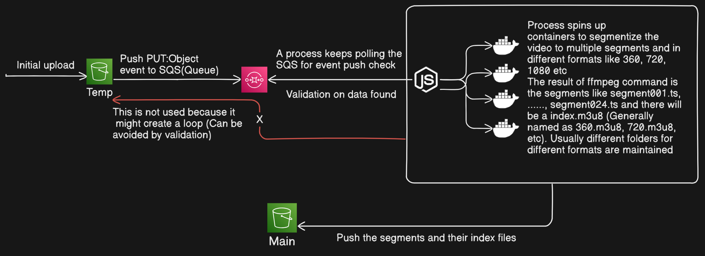

# Trying to build a Video Transcoder using ffmpeg
## Reference
- https://www.youtube.com/watch?v=WpfI9ge5HYE

## Design

## Key Points

- Remember to set correct bucket policy to allow public access
- Create a CORS rule to allow cross origin resource sharing in the main (m3u8 file sharing) bucket
- Find a way to get logs from ECS
- Cleanup queue only after transcoding is done